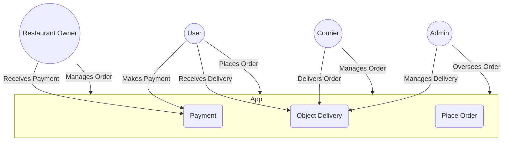

# Lab 2: Architecture Design and API Planning

### Objective

In this lab, you will design the architecture of a full-stack application and plan the API endpoints that will be implemented in the backend. You will create system diagrams and document the API contracts.

# Tasks

## 1. Architecture Design

Create a Use Case Diagram to represent how users interact with the system.

Draw a Class Diagram to define the key entities and their relationships.

Design a System Architecture Diagram that illustrates:

Flutter frontend

Spring Boot backend

Database (e.g., PostgreSQL or MySQL)

API communication between frontend and backend


## 2. API Planning

Identify the required REST API endpoints based on the user stories from Lab 1.

Document each endpoint with the following details:

HTTP Method (GET, POST, PUT, DELETE)

Endpoint URL

Request Parameters (Query Params, Path Variables, or Body)

Response Format (Success & Error Responses)


Use Swagger (OpenAPI) or Postman to document the API contract.


# Deliverables

## 1. Diagrams:

Use Case Diagram

Class Diagram

System Architecture Diagram


## 2. API Documentation:

API contract with details of each endpoint

Optional: Swagger/OpenAPI JSON/YAML file


# Examples:

## Use case diagram



## Swagger config

```
openapi: 3.0.0
info:
  title: Food Order API
  description: API for placing and tracking food orders
  version: 1.0.0
servers:
  - url: https://api.foodorder.com/v1
    description: Production server
paths:
  /order:
    post:
      summary: Place a food order
      description: Accepts a food order and returns an estimated time of arrival (ETA).
      operationId: placeOrder
      requestBody:
        required: true
        content:
          application/json:
            schema:
              type: object
              properties:
                items:
                  type: array
                  items:
                    type: object
                    properties:
                      name:
                        type: string
                      quantity:
                        type: integer
                        minimum: 1
                address:
                  type: string
              required:
                - items
                - address
      responses:
        "200":
          description: Order placed successfully
          content:
            application/json:
              schema:
                type: object
                properties:
                  orderId:
                    type: string
                  eta:
                    type: string
                    example: "30 minutes"
        "400":
          description: Invalid request
    
    get:
      summary: Get order status
      description: Retrieves the status and ETA of an existing order.
      operationId: getOrderStatus
      parameters:
        - name: orderId
          in: query
          required: true
          schema:
            type: string
      responses:
        "200":
          description: Order status retrieved successfully
          content:
            application/json:
              schema:
                type: object
                properties:
                  status:
                    type: string
                    example: "In Progress"
                  eta:
                    type: string
                    example: "15 minutes"
        "404":
          description: Order not found

```