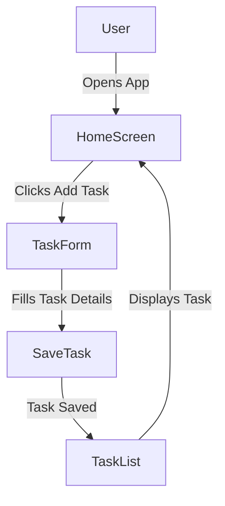
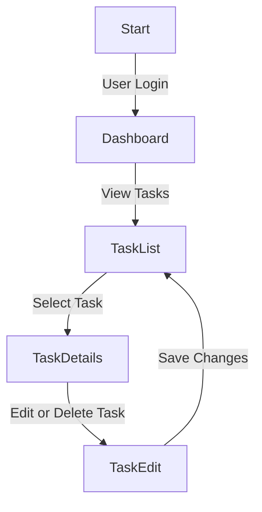
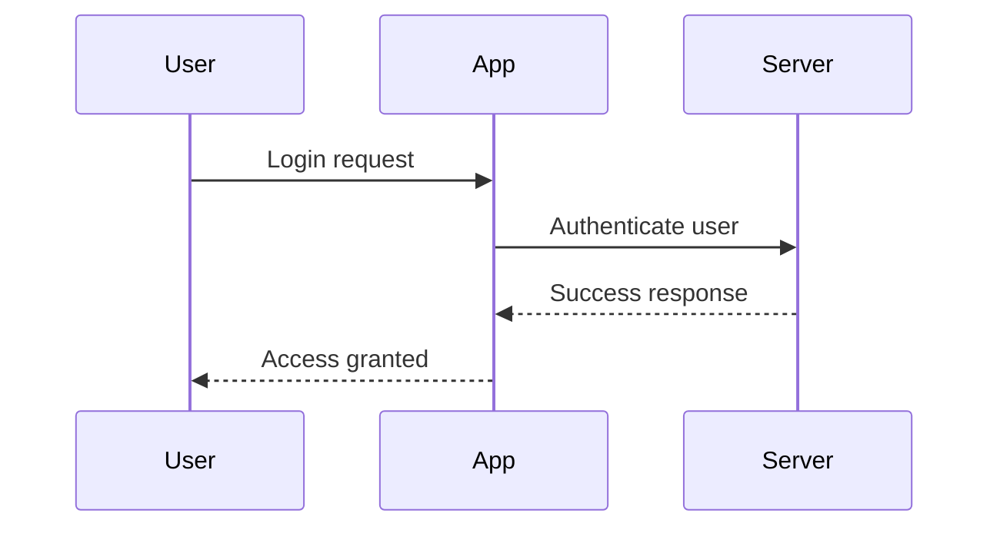
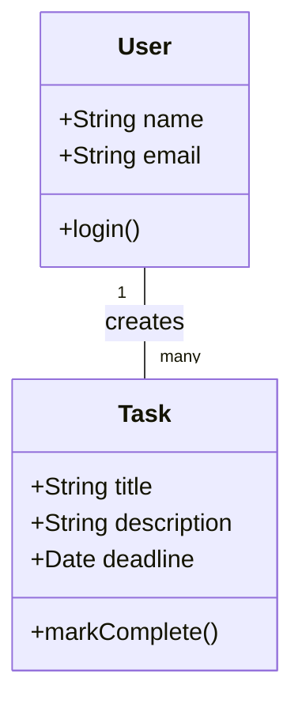
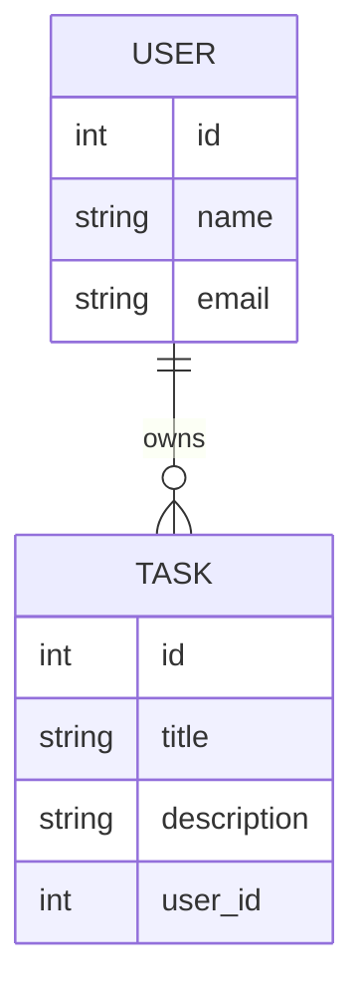
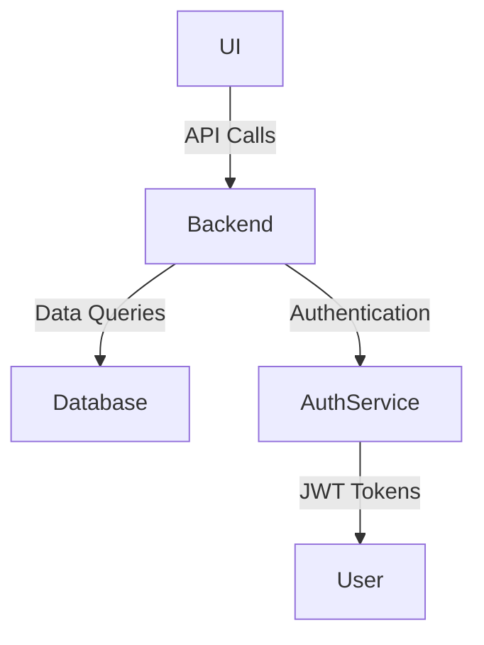
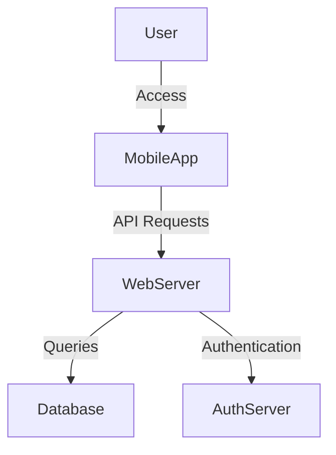
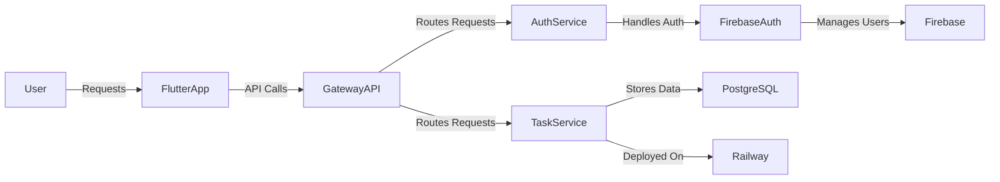

# **Lab 1: Introduction & Requirement Analysis**

## **Objective**
In this lab, students will learn how to analyze project requirements, define the scope, and document user stories. They will also create a basic flowchart using Mermaid.js to visualize system interactions.

---

## **1. Introduction to Software Development Methodologies**

### **1.1 What is a Software Development Methodology?**
Software development methodologies provide a structured approach to building software efficiently. They help teams manage complexity, collaborate effectively, and ensure the final product meets user expectations.

### **1.2 Agile vs. Waterfall Methodologies**
The two most widely used software development methodologies are Agile and Waterfall. Below is a comparison:

| **Feature**        | **Waterfall**                   | **Agile**                     |
|--------------------|--------------------------------|-------------------------------|
| Approach          | Sequential                     | Iterative & incremental       |
| Flexibility       | Low                             | High                          |
| Customer Involvement | Limited                     | Continuous feedback           |
| Documentation     | Heavy                          | Lightweight                   |
| Example Methods  | SDLC, V-Model                   | Scrum, Kanban                 |

### **1.3 Why Agile is Popular?**
- Agile promotes adaptability and continuous improvement.
- It allows incremental releases, reducing risks.
- Encourages collaboration between teams and customers.

### **1.4 Real-World Examples of Agile and Waterfall**

#### **Waterfall Example: Developing a Banking System**
- **Phase 1 (Requirement Analysis):** Gathering strict financial and security regulations.
- **Phase 2 (Design):** Creating a well-documented architecture that ensures compliance.
- **Phase 3 (Implementation):** Developers build the system based on a fixed design.
- **Phase 4 (Testing):** Rigid testing phases ensure that all security and financial requirements are met.
- **Phase 5 (Deployment & Maintenance):** Deployment happens only after all phases are completed.
- **Why Waterfall?** Banking applications require strict security, compliance, and no room for changing requirements midway.

#### **Agile Example: Developing a Mobile App (e.g., Task Management App)**
- **Iteration 1:** Basic task creation and listing functionality.
- **Iteration 2:** Adding task deadlines and status updates.
- **Iteration 3:** User authentication and cloud synchronization.
- **Iteration 4:** UI/UX improvements based on user feedback.
- **Why Agile?** Mobile apps require continuous updates, feature enhancements, and adaptation to user needs.

---

## **2. Understanding Project Requirements**

### **2.1 Defining the Scope**
To build a successful project, understanding and defining the scope is crucial. Consider:
- **What problem are we solving?**
- **Who are the users?**
- **What features are required?**
- **What are the constraints?**

### **2.2 Example Project: Task Management App**
**Project Description:**
A mobile app that allows users to create, manage, and track daily tasks efficiently.

**Core Features:**
1. User authentication (sign-up, login).
2. Task creation, updating, and deletion.
3. Task status tracking (pending, completed).
4. Task deadline notifications.
5. Cloud storage for data persistence.

### **2.3 Writing User Stories**
A user story describes a feature from the user's perspective. Format:
```
As a [role], I want [feature] so that [benefit].
```
#### **Example User Stories:**
1. **As a user, I want to create tasks so that I can track my daily activities.**
2. **As a user, I want to set task deadlines so that I can manage my time effectively.**
3. **As a user, I want to mark tasks as completed so that I can track my progress.**
4. **As a user, I want to receive task reminders so that I don't forget my deadlines.**
5. **As a user, I want to delete tasks so that I can remove unnecessary items.**

---

## **3. Creating Flowcharts with Mermaid.js**

### **3.1 Introduction to Mermaid.js**
Mermaid.js allows the creation of diagrams using a simple text-based syntax, useful for visualizing workflows and system interactions.

### **3.2 Types of Diagrams in Software Development**

## **1. Flowchart**
### **Description:**
A flowchart represents the logical flow of a system, showing the sequence of steps and decisions. It is useful for illustrating workflows and processes.

### **Example (Mermaid.js):**





---

## **2. Sequence Diagram**
### **Description:**
A sequence diagram shows the interaction between different components or actors in a system over time, focusing on the order of messages.

### **Example (Mermaid.js):**


---

## **3. Class Diagram**
### **Description:**
A class diagram represents the structure of a system by defining classes, their attributes, methods, and relationships.

### **Example (Mermaid.js):**


---

## **4. Entity-Relationship Diagram (ERD)**
### **Description:**
An ERD visualizes the relationships between entities in a database, showing tables, primary keys, and foreign keys.

### **Example (Mermaid.js):**


---

## **5. Component Diagram**
### **Description:**
A component diagram illustrates the different components of a system and their interactions, focusing on modularity and dependencies.

### **Example (Mermaid.js):**


---

## **6. Deployment Diagram**
### **Description:**
A deployment diagram shows the physical deployment of components in a network, including servers, databases, and external services.

### **Example (Mermaid.js):**



### **3.3 Steps to Generate a Mermaid.js Diagram**
1. Open [Mermaid Live Editor](https://mermaid-js.github.io/mermaid-live-editor).
2. Copy and paste the Mermaid.js syntax.
3. Generate the diagram and refine if needed.

---

## **4. Practical Task**

### **4.1 Define Requirements for a Simple Task Management App**
- Identify the main features needed.
- Write at least **5 user stories**.

### **4.2 Create a Mermaid.js Flowchart**
- Design a simple workflow for the app (e.g., task creation process).
- Use the Mermaid Live Editor to visualize it.

---

## **5. Defining System Architecture**

### **Group Exercise: How Do You See the System Architecture?**
Before diving into specific frameworks and tools, let's explore different architectural perspectives.

#### **Discussion Questions:**
1. How would you structure the system to ensure scalability and maintainability?
2. What major components or services would you include?
3. How should different parts of the system communicate (e.g., REST, WebSockets, messaging queues)?
4. What security measures should be in place for authentication and data protection?
5. How do you envision the deployment process?

---

### **Frameworks and Tools Used in Our Project**

#### **1. Backend: Spring Boot Microservices**
- Used to build scalable, modular backend services.
- Features include RESTful APIs, security, and database integration.

#### **2. Frontend: Flutter**
- A cross-platform UI framework for mobile and web.
- Provides a fast and efficient development experience with a single codebase.

#### **3. Authentication: Firebase Auth**
- Handles user authentication securely.
- Supports email/password, Google sign-in, and other authentication methods.

#### **4. Deployment: Railway**
- Cloud platform for easy deployment of microservices.
- Integrates well with databases and CI/CD pipelines.

#### **5. Database: PostgreSQL**
- A relational database for storing structured data.
- Scalable and reliable for production applications.

---

### **Architecture Diagram**
Below is the final high-level architecture



This architecture ensures:
- **Security** via Firebase Authentication.
- **Scalability** using microservices.
- **Seamless Deployment** on Railway.

--- 

## **6. Submission & Evaluation**

### **Submission Guidelines**
- Submit a Markdown or PDF document containing:
    - Defined project requirements.
    - User stories.
    - Mermaid.js flowchart syntax.
